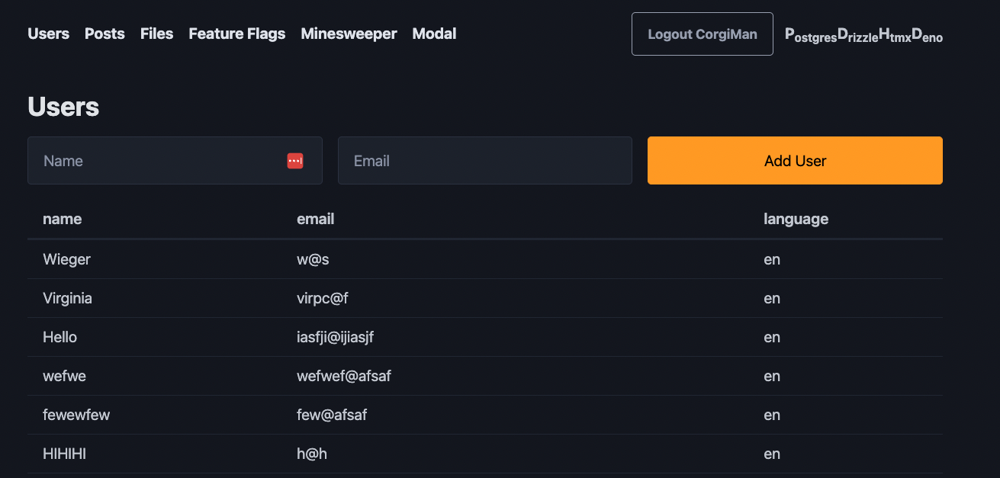
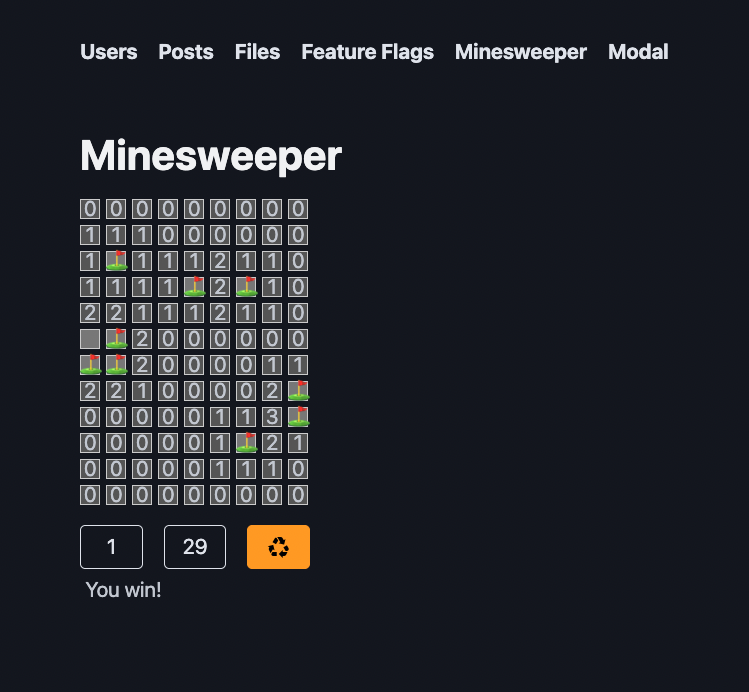

# PDHD

PDHD is a techstack using Postgres, Deno, HTMX and Drizzle.

# Features of the HDD stack

- live reload
- auto adds index.html if needed
- shows toast errors
- array utils

- schema utils to auto add id, createdAt, updatedAt, deletedAt
- and auto add indexes for foreign keys
- auto joins with db.fetch

- template rendering with eta
- auto add endpoints to router
- feature flags
- worker thread for cpu intensive tasks
- static file caching (set headers)
- i18n
- auth with JWT
- login with email and password or OAUTH2

# Screenshots

# To do

- @scope with css (maybe xs s m l xl and light/dark mode?)
- display size of numbers as image
- playwright
- pupsub, rabbitMQ
- local s3 for development
- in memory sqlite/postgres try out pglite
- roles, permissions and specialized db views for those roles
- sanitize data based on role, helper functions to remove pii and somehow don't expose raw tables

Boring...
- graceful shutdown - cancel job signal
- logging, metrics, tracing, rate limiting
- i18n: comments, reviews, error check, verified (translate?), UI, delete, add, edit, search, filter, export to json
- timezones and time i18n
- test oauth2 with google
- gcp, aws, azure

# Todo: Views with soft delete

- views to auto exclude deletedAt rows
- or soft deletes on fetch (utility to add it to where clause easily)
- delete utility to set deletedAt fields (maybe cascading even)
- revive utility to revive all parents as well
- remove ability to delete with drizzle
- maybe just add to fetch?

# Todo: Worker Queue

Full sync every minute job queue w/ db Every second try schedule jobs with runAt > now Create trigger, add to in-mem job queue, try schedule

trySchedule

- if thread available
- dispatch job
- update db and in-mem storage with lockedBy and lockedAt timestamps

onResult

- mark thread as free
- delete from db and in-mem
- try schedule jobs with runAt > now
- resolve any registered promised

onError

- mark thread as free
- update db and in-mem (increase retries and runAt with exponential backing)
- try schedule jobs with runAt > now
- reject any registered promises for this job

# Magic

Magic is always a bad idea, that being said there are some things that are even worse. In `array-utils.js` I have extend array with `sum`, `min`, `max`, `group`, `key` and `sortBy`
methods. Extending Array is generally discouraged, but not having to use reduce or importing lodash is worth it. I've also added `$keys`, `$values`, `$entries` methods to objects
because I find the Object.keys syntax poor.

When adding tables I created table function in `schema-utils.js` file that will add `id`, `createdAt`, `updatedAt`, `deletedAt` fields to the table that are filled automatically.
The id is similar to a ULID consisting of a timestamp and some random bytes. I use this format because it's a bit easier to generate by Postgres. It will also automatically add
indexes foreignKeys automatically. The additional data cost is totally worth not having to debug performance issues you will encounter later on.

The other bit of magic is a utility `fetch` function on the db to fetch data from the database. When supplied with the object you would normally pass to `db.select`, fetch will
automatically left join tables based on column names (e.g. userId can be joined with user.id). If you want another join type then the `left`, `right`, `inner`, `outer` functions
are available.

